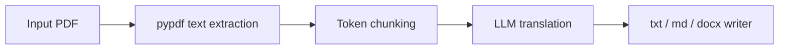

# PDF Text-Only Translation

Translate PDF documents by extracting their text content, running it through the
standard translation pipeline, and writing structured output as **`.txt`**, **`.md`**, or **`.docx`**.

This mode is designed for books, papers, and reports where the **content** matters
more than exact page layout. It does **not** preserve images, complex tables, or
pixel-perfect formatting, and it does **not** produce a translated PDF file.

Closes the pragmatic scope discussed in [issue #140](https://github.com/hydropix/TranslateBooksWithLLMs/issues/140).

---

## Supported

| Input | Output |
| --- | --- |
| `.pdf` with extractable text | `.txt`, `.md`, or `.docx` |

## Not supported (v1)

- Scanned/image-only PDFs (no OCR)
- PDF-to-PDF layout preservation
- Table structure fidelity
- Embedded images and figures

---

## CLI

Default output for PDF input is **Markdown** when `-o` is omitted:

```bash
python translate.py -i book.pdf -sl English -tl French
# -> book (French).md
```

Choose the output format with `-o`:

```bash
python translate.py -i paper.pdf -o paper_fr.txt -sl English -tl French
python translate.py -i paper.pdf -o paper_fr.md -sl English -tl French
python translate.py -i paper.pdf -o paper_fr.docx -sl English -tl French
```

Refine-only on PDF (already translated text inside the PDF):

```bash
python translate.py -i translated.pdf -o polished.md --refine-only -tl French
```

---

## Web UI

1. Upload a `.pdf` file on the **Translate** tab.
2. In **Settings**, choose **PDF output format** (Markdown, plain text, or Word).
3. Run translation as usual.
4. Download the generated `.md`, `.txt`, or `.docx` file.

The naming convention pattern still applies; `{ext}` resolves to the selected
PDF output format, not `.pdf`.

---

## How it works



- **Extraction:** [`src/core/pdf/extractor.py`](../src/core/pdf/extractor.py)
- **Adapter:** [`src/core/adapters/pdf_adapter.py`](../src/core/adapters/pdf_adapter.py)
- **Writers:** [`src/core/pdf/output_writers.py`](../src/core/pdf/output_writers.py)

Webhook notifications, checkpoints, and parallel chunk translation work the
same as for other text-based formats.

---

## Troubleshooting

**`No extractable text found in PDF`**
The file is likely scanned or image-based. OCR is not part of v1.

**Garbled or missing paragraphs**
Some publishers use custom font encodings. Try exporting the source as text from
your PDF reader and translating the `.txt` instead.

**Output extension is `.txt` unexpectedly**
Only `.txt`, `.md`, and `.docx` are valid PDF output targets. Other extensions
fall back to `.txt`.

---

## Dependency

PDF support requires `pypdf` (listed in `requirements.txt`).
